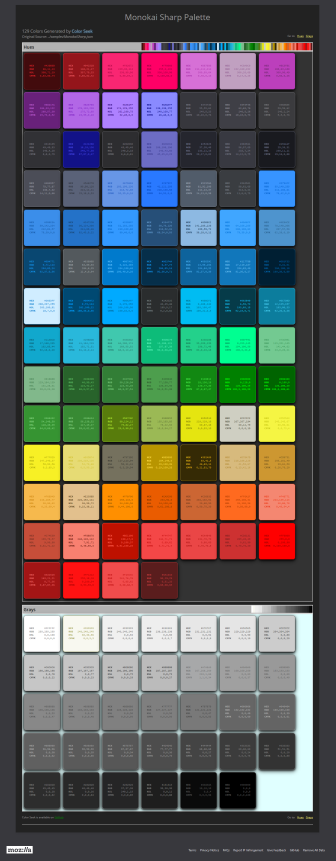

# Color Seek - Version 1.0 #

## Overview ##

**Color Seek** allows you to build a color palette from a source file or URL. The source is scanned for valid
CSS color values and the results are formatted, purged of duplicates, and then sorted to produce the 
_Color Palette_. The palette can then be transformed into several predefined file formats for use in your projects.
In addition, a HTML page is created which displays the palette as a grid of swatches, with the colors displaying 
their value in each CSS format.

---

### CSS Color Formats ###

CSS currently accepts three formats for color specification.

| Format    | Example                      | Description                                                    |
|-----------|------------------------------|----------------------------------------------------------------|
| Hex       | `#1188FF`                    | Hexadecimals of Red (11), Green (88), Blue (FF)                |
| RGB       | `rgb(32, 128, 255)`          | Range for Red (0-255), Green (0-255), Blue (0-255)             |
| HSL       | `hsl(359, 25%, 100%)`        | Range for Hue (0-359), Saturation (0-100%), Lightness (0-100%) |

#### Possible CSS4 Color Formats ####

Proposals exist for additional color formats in CSS4. One, _CMYK_, is well known outside of CSS and has been in use
for many years in printing and graphic design. Therefore, we've decided to add it as a bit of future-proofing.

| Format    | Example                      | Description                                   |
|-----------|------------------------------|-----------------------------------------------|
| CMYK      | `cmyk(100, 25, 50, 75)`      | Range of Cyan, Magenta, Yellow, Black (0-100) |

#### Named Colors ####

Another naming convention for color values is a _named color_. There are currently 140 color names available ranging
from _black_ to white. **Color Seek** looks for named colors and converts them to hexadecimal. 

### Output File Types ###

A color palette can be rendered into several formats simultaneously. Along with CSS, SASS and LESS are available 
as output options. You may also choose the Gimp Color Palette format as well. An HTML file is always generated 
automatically regardless of what other options as selected.

#### File Formats ####

Each of the formats below can be generated when creating a palette.

| File Type | Description           |
|-----------|-----------------------|
| CSS       | Cascading Style Sheet |
| GPL       | Gimp Color Palette    |
| LESS      | Less Style Sheet      |
| SCSS      | Sass Style Sheet      |

---

## Using Color Seek ##

### Command Line ###

All interaction with **Color Seek** is through the Command Line Interface (CLI). All valid commands and switches are available via the help display.

#### Help ####

'colorseek -h' or 'colorseek --help' displays the available commands:

| Command                 | Description                                          |
|-------------------------|------------------------------------------------------|
| -i, --input [PATH]      | *The source file or url to search for color values   |
| -o, --output [DIRECTORY]| The output file(s) directory                         |
| -n, --name              | The output file(s) name (do not add extension)       |
| --css                   | Create a CSS rendering of the color palette          |
| --gpl                   | Create a Gimp Palette rendering of the color palette |
| --less                  | Create a LESS rendering of the color palette         |
| --scss                  | Create a SASS rendering of the color palette         |

***Required**

---

When no output directory is specified the current directory will to used. If no output name is specified the input file
name will be used.

All file types can be rendered by adding the corresponding command switch. If no output type is given only the HTML 
file will be generated.

### Examples ###

The following command line examples demonstrate **Color Seek** functionality.

    $ colorseek -i /c/docs/MonokaiSharp.json -css -n "Monokai-Sharp"

The file used as input is a Visual Studio Code color theme that was exported as a JSON file. **Color Seek** creates 
a CSS file and a HTML page named _Monokai-Sharp.css_ and _Monkikai-Sharp.html_ respectively.

In this example no output directory, output name, or file renditions was
specified. Therefore, only a Html page displaying the unique colors found the the Json file is created.
