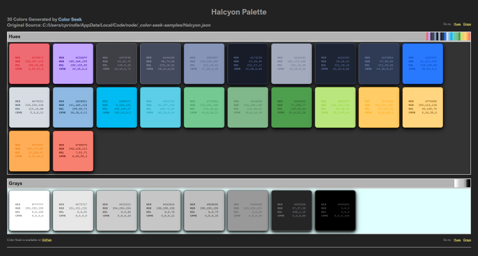
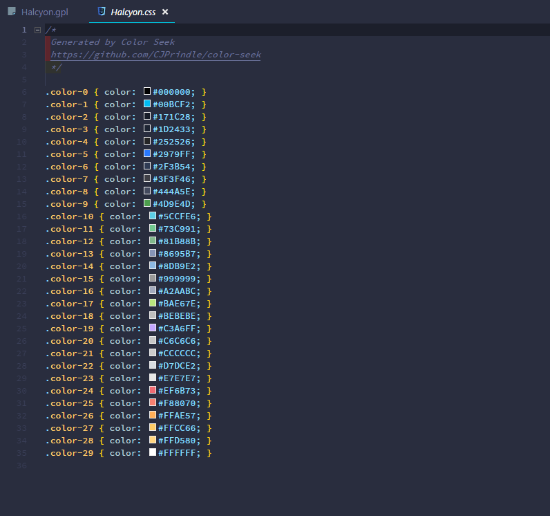
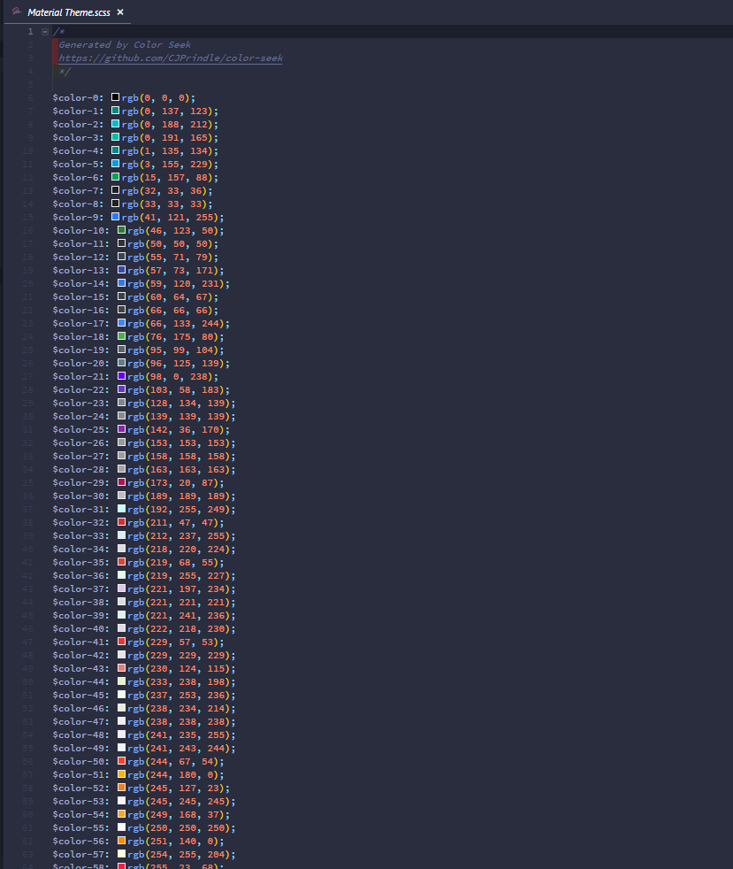

# Color Seek #

Version 0.1 | [Full Documentation (API)](https://cjprindle.github.io/color-seek).

## Overview ##

**Color Seek** allows you to build a color palette from a source file or URL. The source is scanned for valid
CSS color values and the results are formatted, purged of duplicates, and then sorted to produce the 
_Color Palette_. The palette can then be transformed into several predefined file formats for use in your projects.
In addition, a HTML page is created which displays the palette as a grid of swatches, with the colors displaying 
their value in each CSS format.

`Example: HTML Color Palette`

---

### CSS Color Formats ###

CSS currently accepts three formats for color specification.

| Format    | Example                      | Description                                                    |
|-----------|------------------------------|----------------------------------------------------------------|
| Hex       | `#1188FF`                    | Hexadecimals of Red (00-FF), Green (00-FF), Blue (00-FF)       |
| RGB       | `rgb(32, 128, 255)`          | Range for Red (0-255), Green (0-255), Blue (0-255)             |
| HSL       | `hsl(359, 25%, 100%)`        | Range for Hue (0-359), Saturation (0-100%), Lightness (0-100%) |

#### CMYK ####

_CMYK_ is a proposed color format for CSS4. It is well known outside of CSS and has been in use
for many years in printing and graphic design. It is included on the HTML output and will be a color format option
when/if it is included in CSS.

#### Named Colors ####

This version **does not** parse _Named Colors_. It is on the list of enhancements.

### Output File Types ###

A color palette can be rendered into several formats simultaneously. Along with CSS, SASS and LESS are available 
as output options. You may also create a Gimp Color Palette. 

An HTML file is generated automatically regardless of other options selected.

#### File Formats ####

Each of the formats below can be generated when creating a palette.

| File Type | Description           |
|-----------|-----------------------|
| CSS       | Cascading Style Sheet |
| GPL       | Gimp Color Palette    |
| LESS      | Less Style Sheet      |
| SCSS      | Sass Style Sheet      |

---

## Using Color Seek ##

### Command Line ###

All interaction with **Color Seek** is through the Command Line Interface (CLI). All valid commands and switches are available via the help display.

#### Help ####

'colorseek -h' or 'colorseek --help' displays the available commands:

| Command                 | Description                                         |
|-------------------------|-----------------------------------------------------|
| -i, --input [PATH]      | The source file or url to search for color values * |
| -o, --output [DIRECTORY]| The file(s) output directory                        |
| -n, --name              | The output file(s) name (_do not add extension_)    |
| --css                   | Create a CSS file                                   |
| --gpl                   | Create a Gimp Color Palette file                    |
| --less                  | Create a LESS file                                  |
| --sass                  | Create a SASS file                                  |

    * Required

When no output directory is specified the **Color Seek** directory will be used. If no output name is specified the 
input file name will be used.

All file types can be rendered by adding the corresponding command switch. If no output type is given then only the 
HTML file will be generated.

---

### Examples ###

The following examples demonstrate various options available with **Color Seek**. 

**NOTE**: An HTML rendition of the color palette is **always** included.

#### Create CSS with Hex Colors from a Local File Source #### 

    $ colorseek -i /c/docs/Halcyon.json --css

+ A CSS file was created named *Halcyon.css*
+ If the -o (--output) command switch is not set all output files will be saved to the **Color Seek** directory
+ If the -n (--name) command switch is not set all output files will use the input file name

(**FYI**: The input file used is a [Visual Studio Code](https://code.visualstudio.com) color theme exported
to a JSON file.)

`Example: CSS Output with Hex Color Values`

---

#### Create SASS with RGB Colors from a URL Source ####

    $ colorseek -i https://material.io/static/m2/css/main.min.css -n "Material Theme" --sass --rgb

+ Using a URL is identical to using a file. **Color Seek** determines the input source automatically. 

+ The --sass command switch creates a file named _Material Theme.scss_

+ All color formats expect Hex _(default)_ the require a command switch (--rgb, --hsl, etc).

**NOTE**: Double quotes are required for command line entries with one or more spaces.

`Example: A SASS File with RGB Color Values`

---

#### Create Multiple Files with HSL colors in a Specifie#d Directory ####

    $ colorseek -i https://material.io/static/m2/css/main.min.css -o c:\\docs -n "Material Styles" --css --sass --less --hsl

+ Multiple files can be created by adding a command switch
 
+ The '-o' ('--output') command switch specifies the output directory for all files
 
+ All files are assigned the -n (--name) value

+ The HSL color format is used in all files

`Example: Multiple Files Created with One Command`

---

#### Create a Gimp Palette File ####

    $ colorseek -i /c/docs/Halcyon.json --gimp

+ A Gimp Palette File has a custom format and will ignore color format command switches

+ Creates a file with the '.gpl' extension

`Example: A Gimp Palette File`

---

## Summary ##

Thus concludes this overview. If you find **Color Seek** useful please let me know. I encourage all feedback and 
suggestions so please do not hesitate to contact me.

### ENJOY! ###